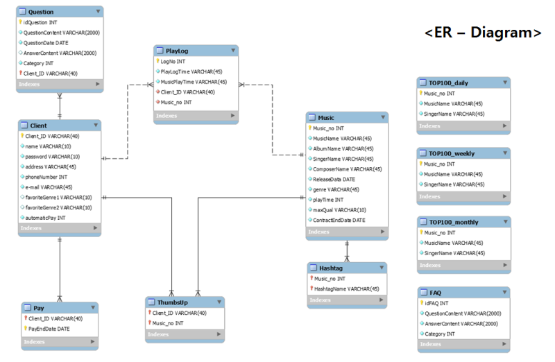

# Hana EZ(easy-one) 외환 플랫폼,Hana Global

[프로젝트 홈페이지 ((https://koposoftware.github.io/2022_3_sykim/)

# 1. 프로젝트 소개
### 1-1.프로젝트 배경
• 현재 원/달러 환율이 2009년 7월 13일(1315.0원)이후 13년 만에  1400원대를 기록하면서, 환율, 금리, 물가등 '3중고'를 겪고 있다.
• 이러한 시장 현황에 환전과 해외 송금을 주로 하는 유학생과 학부모의 희비가 엇갈리며 금전 부담을 느끼고 있다.
• 해외송금과 환전 서비스를 자주 이용했었던 같은 유학생으로서 외환 서비스를 이용하면서 불편했던 점은 개선함으로써 고객의 만족을 증진하기 위해 기획하였다.

# 2. 구성
### 2-1.개발 환경
* JDK : java 1.8
* WAS : Tomcat 9.0
* DB: ORACLE 19C

### 2-2. 사용 기술

* Spring 기반 웹 페이지 제작  
* Spring Scheduler 기반 예약 송금 구현 
* Python 환율 정보 크롤링 
* CoolSMS를 이용한 문자전송 구현 
* Spring Locale 한국어, 영어, 일본어 3개 언어 지원 
* API : Naver CLOVA OCR, Kakao Message, Kakao Map 
* FullCalendar 라이브러리를 활용한 캘린더 구현 

### 2-3. 서비스 아키텍처

### 2-4. 시스템 아키텍처

# 3. 프로젝트 제안서
[발표자료](/project.pptx) 

# 4. 프로젝트 결과
    
    
   
## 발표 ppt 
[발표자료](/project.pptx) 

## 시연 동영상 

  <iframe width="424" height="238" src="https://www.youtube.com/embed/reOGfxYJre0" title="YouTube video player" frameborder="0" allow="accelerometer; autoplay; clipboard-write; encrypted-media; gyroscope; picture-in-picture" allowfullscreen></iframe>

# 5. 기타

 
# 6. 본인 소개

|이름   |  김선영 |
|연락처 | sunyoung_96@naver.com|

|skill set| 
|| Frontend - HTML, CSS, Javascript|
|| Backend - Java, Spring, Oracle|

|자격증| 
|| 2021.09.24 ADsP |
|| 2021.09.01 GAIQ |

